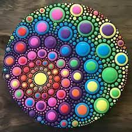
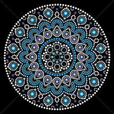
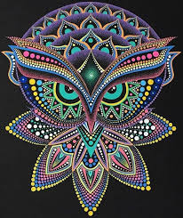

# Üdvözöllek az oldalamon

A pontfestészet az ausztrál őslakosok (Aboriginal Australians) művészetének egyedülálló és szerves része. Kezdetben a homokba, földre pöttyözték az ábrákat, mintákat, mely törzsi történeteknek szent jelentései voltak. Egy-egy festmény adott szertartáshoz, rituáléhoz tartozott. A beavatatlanok soha nem láthatták ezeket a rajzokat, szent mintákat, mivel a földet újra elsimították a szertartás után.

## Galéria

  
  
  
  <!-- Add more image tags and anchor tags for your other photos -->

